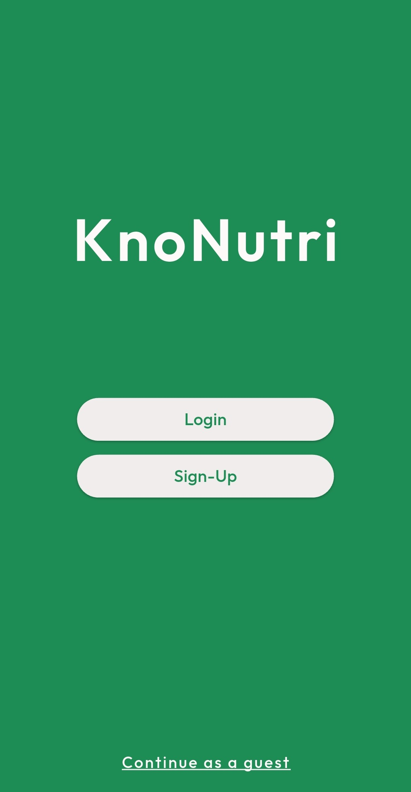
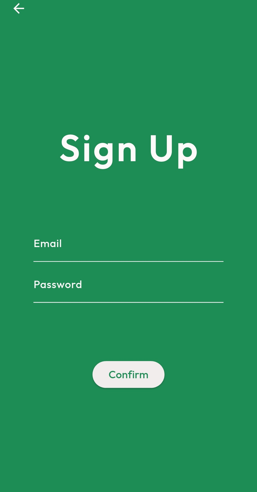
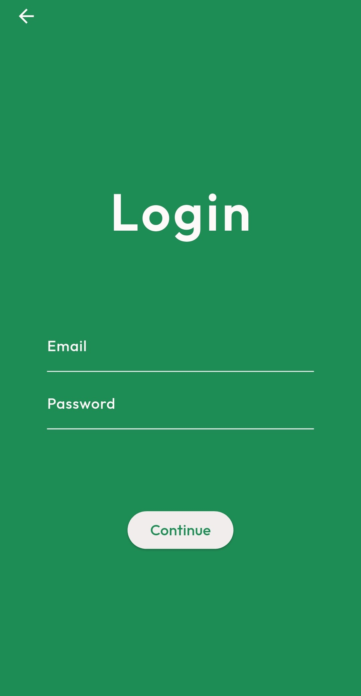
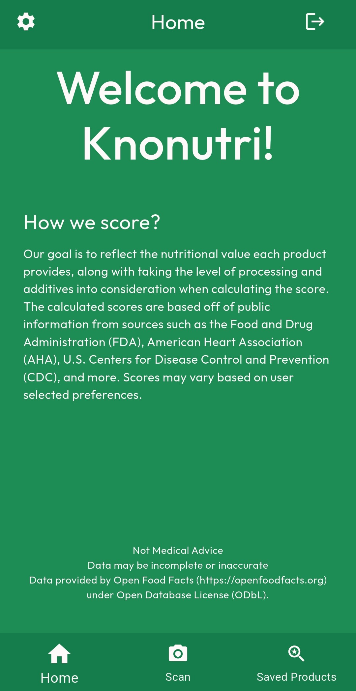
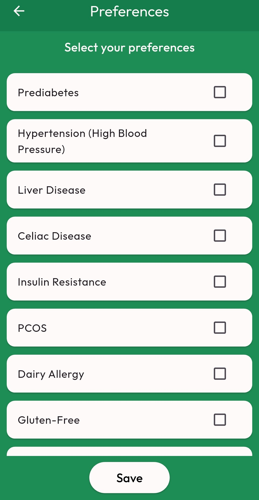
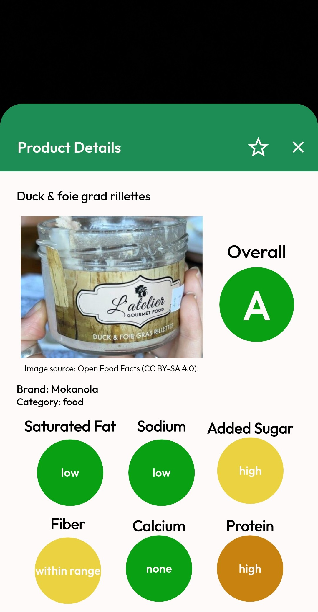
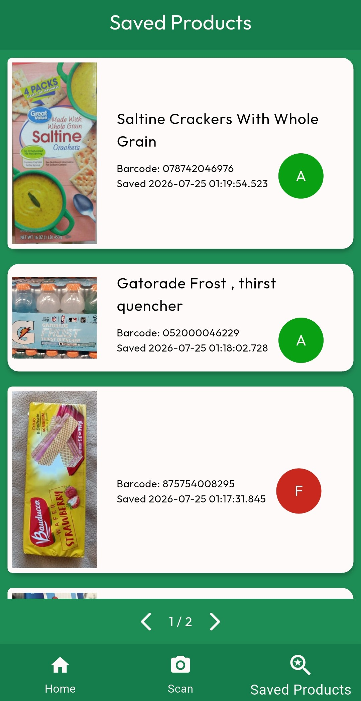

# Knonutri - App Portfolio
This repository contains screenshots and a visual overview of the Knonutri mobile app.
The full source code is private.

## About the App
Knonutri is a cross-platform nutrition app that allows users to scan barcodes, retrieve product information, and generate nutrition scores using a Python backend. The app uses Firebase Authentication and Cloud Firestore for user management and data storage.

## Features
- Flutter-based mobile UI
- Firebase Authentication (email/password)
- Cloud Firestore for storing user data and saved product history
- Barcode scanning using the device back camera
- Nutrition scoring using a Python backend

## Tech Stack
- **Frontend:** Flutter (Dart)
- **Backend:** Python scoring service
- **Database:** Firebase Cloud Firestore
- **Authentication:** Firebase Auth
- **Barcode scanning:** Flutter camera & barcode scanning plugin
- **Platform:** Android

## Screenshots

## Roadmap
- Improve nutrition scoring model by using user preferences to modify scores.
- Improve UI (dark mode)

## License
This repository contains only screenshots.
The full source code is private and not licensed for public use.
